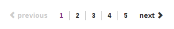
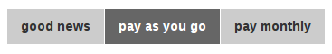
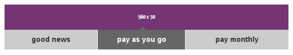
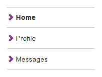
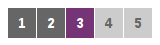

sass-bootstrap-purple
=====================

Purple theme for [Twitter Bootstrap](http://getbootstrap.com/).

This project is based on [jlong/sass-bootstrap](https://github.com/jlong/sass-bootstrap).
It adds the following additions and changes:


headlines
---------

Headlines have been modified to match the Purple web guideline.

> The Purple brand font is Helvetica Neue and consists of five weights: 35 Thin,
> 45 Light, 55 Roman, 65 Medium and 75 Bold.
> Arial is a standard system font used by browsers. Whilst the majority of text
> on an Purple site is HTML Arial, the page designs also occasionally use a
> graphical version of Helvetica Neue to reinforce the brand identity.


```html
<div class="row">
  
  <h1  class="col-lg-11 col-md-11 col-sm-11">h1 - title</h1>
</div>

<h2>h2 - large headlines</h2>
<h3>h3 - medium headlines</h3>
<h4>h4 - headers</h4>
<h5>h5 - sub headers / small headlines</h5>
```


colour palette
--------------

Colour palette has been modified to match the Purple web guideline.

> Colours can be used for certain functions in places where there are strongly
> established conventions. For example, green can be used on a button to accept
> a call and red can be used on the button to end a call. The functional colours
> are:
>   - **Green** `#32C832`: positive: add, call or save.
>   - **Red** `#CD3C14`: negative: remove, delete, critical alert, end call,
>     cancel.
>   - **Blue** `#527EDB`: neutral / information: new, edit, settings/wizard,
>     notification counter, help, info, sync, upload, download.
>   - **Yellow** `#FFCC00`: caution / warning: caution alert.


```html
<button type="button" class="btn btn-default">default</button>
<button type="button" class="btn btn-primary">primary</button>
<button type="button" class="btn btn-success">success</button>
<button type="button" class="btn btn-info">info</button>
<button type="button" class="btn btn-warning">warning</button>
<button type="button" class="btn btn-danger">danger</button>
<button type="button" class="btn btn-link">link</button>
```


tables
------

Tables have been modified to match the Purple web guideline.

> When using tables to present tabular information, use spacing, alignment, and
> indents, not borders, to delimit tabular information.
> Left align text within columns, and right align quantitative data (e.g.
> prices, quantity). Use colour to place emphasis on important information such
> as to highlight summary detail, or unread email.


```html
<table class="table">
  <thead>
    <tr>
      <th class="active">date</th>
      <th>number</th>
      <th>place number</th>
      <th>call class</th>
      <th>duration</th>
      <th>cost</th>
    </tr>
  </thead>
  <tbody>
    <tr>
      <td>08/10/12</td>
      <td>442084459876</td>
      <td>Purple text messaging</td>
      <td>text</td>
      <td>0:00:00</td>
      <td>0.000</td>
    </tr>
    <!-- ... -->
  </tbody>
</table>
```


global navigation
-----------------

Bootstrap's nav bar has been modified to match the Purple guideline's global
navigation.

> The global navigation is fixed at the top of the page allowing the page
> content to scroll beneath. The global navigation provides several key
> functions:
>   - important links prominent and accessible.
>   - users with scope of what’s available.
>   - enables navigation of deeper hierarchies without going to a separate page.
>   - provides a fully touch compliant experience for tablet users.
>   - creates an unobtrusive system of navigation.


```html
<nav class="navbar navbar-fixed navbar-default" role="navigation">
  <div class="container">

    <div class="navbar-header">
      <button type="button" class="navbar-toggle" data-toggle="collapse" data-target="#my-global-navigation">
        <span class="sr-only">toggle navigation</span>
        <span class="icon-bar"></span>
        <span class="icon-bar"></span>
        <span class="icon-bar"></span>
      </button>
    </div>

    <div class="collapse navbar-collapse" id="my-global-navigation">
      <ul class="nav navbar-nav">
        <li><a href="#">Action</a></li>
        <!-- ... -->
      </ul>
    </div>

  </div>
</nav>
```


local navigation
----------------

Bootstrap's inverted nav bar has been modified to match the Purple guideline's
local navigation.

> The local navigation is positioned below the title bar and provides links to
> the main categories of a channel.


```html
<nav class="navbar navbar-inverse" role="navigation">
  <div class="container">

    <div class="navbar-header">
      <button type="button" class="navbar-toggle" data-toggle="collapse" data-target="#my-local-navigation">
        <span class="sr-only">toggle navigation</span>
        <span class="icon-bar"></span>
        <span class="icon-bar"></span>
        <span class="icon-bar"></span>
      </button>
    </div>

    <div class="collapse navbar-collapse" id="my-local-navigation">
      <ul class="nav navbar-nav">
        <li><a href="#">Action</a></li>
        <!-- ... -->
      </ul>
    </div>

  </div>
</nav>
```


pagination
----------

Bootstrap's pagination has been modified to match the Purple guideline.



```html
<ul class="pagination">
  <li class="disabled"><span><i class="glyphicon glyphicon-chevron-left"></i> previous</span></li>
</ul>
<ul class="pagination">
  <li class="active"><a href="#">1</a></li>
  <li><a href="#">2</a></li>
  <li><a href="#">3</a></li>
  <li><a href="#">4</a></li>
  <li><a href="#">5</a></li>
</ul>
<ul class="pagination">
  <li><a href="#">next <i class="glyphicon glyphicon-chevron-right"></i></a></li>
</ul>
```


breadcrumbs
-----------

Bootstrap's breadcrumbs have been modified to match the Purple guideline.


```html
<ol class="breadcrumb">
  <li><a href="#">start</a></li>
  <li><a href="#">setup</a></li>
  <li class="active"><span>connection</span></li>
  <li class="disabled"><span>identification</span></li>
  <li class="disabled"><span>end</span></li>
</ol>
```


tabs
----

Bootstrap's tabs have been modified to match the Purple guideline.



```html
<ul class="nav nav-tabs">
  <li><a href="#">good news</a></li>
  <li class="active"><a href="#">pay as you go</a></li>
  <li><a href="#">pay monthly</a></li>
</ul>
```


```html
<ul class="nav nav-tabs nav-justified">
  <li><a href="#">good news</a></li>
  <li class="active"><a href="#">pay as you go</a></li>
  <li><a href="#">pay monthly</a></li>
</ul>
```



```html

<ul class="nav nav-tabs nav-justified nav-tabs-bottom">
  <li><a href="#">good news</a></li>
  <li class="active"><a href="#">pay as you go</a></li>
  <li><a href="#">pay monthly</a></li>
</ul>
```


```html
<ul class="nav nav-tabs nav-justified nav-tabs-top">
  <li><a href="#">good news</a></li>
  <li class="active"><a href="#">pay as you go</a></li>
  <li><a href="#">pay monthly</a></li>
</ul>

```


stacked
-------



```html
<ul class="nav nav-stacked">
  <li class="active"><a href="#"><i class="glyphicon glyphicon-chevron-right text-primary"></i> Home</a></li>
  <li><a href="#"><i class="glyphicon glyphicon-chevron-right text-primary"></i> Profile</a></li>
  <li><a href="#"><i class="glyphicon glyphicon-chevron-right text-primary"></i> Messages</a></li>
</ul>

```


steps
-----

Added steps according to Purple guideline.



```html
<ol class="steps">
  <li><a href="#">1</a></li>
  <li><a href="#">2</a></li>
  <li class="active"><span>3</span></li>
  <li class="disabled"><span>4</span></li>
  <li class="disabled"><span>5</span></li>
</ol>
```


footer
------

Added footer according to Purple guideline.

> The footer is included at the bottom of every page and provides quick access
> to the main sections of the site.
>
> It can also contain other elements such as search and social features. Links
> to information such as contact details and terms and conditions are located
> along the bottom of the footer. The amount of links in the footer can vary on
> different sites so ensure the design aligns to the grid and follows the
> spacing rules.


```html
<footer class="footer">
  <div class="container">
    <div class="row">
      <div class="col-lg-2 col-md-2 col-sm-3">
        <ul class="list-unstyled">
          <li><strong>Purple shop</strong></li>
          <li class="divider"></li>
          <li><a href="#">iPad</a></li>
          <li><a href="#">iPhone</a></li>
          <!-- ... -->
        </ul>
      </div>
      <!-- ... -->
      <div class="col-lg-12 col-md-12 col-sm-12">
        <hr/>
        <ul class="list-inline">
          <li><a href="#">about Purple</a></li>
          <li><a href="#">contact us</a></li>
          <!-- ... -->
        </ul>
      </div>
    </div>
  </div>
</footer>
```
